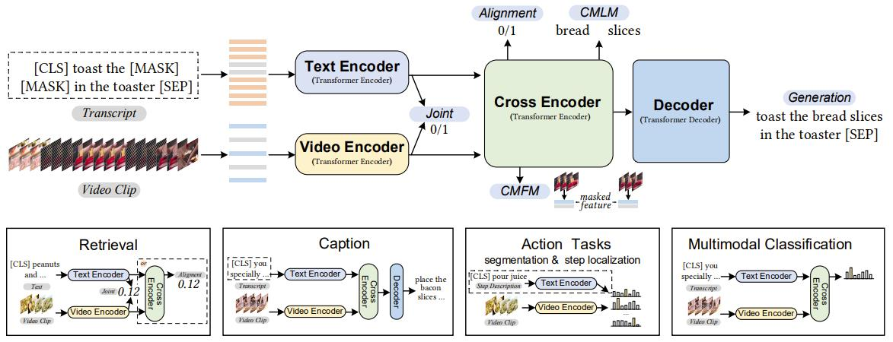

The implementation of paper [**UniVL: A Unified Video and Language Pre-Training Model for Multimodal Understanding and Generation**](https://arxiv.org/abs/2002.06353). 

UniVL is a **video-language pretrain model**. It is designed with four modules and five objectives for both video language understanding and generation tasks. It is also a flexible model for most of the multimodal downstream tasks considering both efficiency and effectiveness.



# Preliminary
Execute below scripts in the main folder firstly. It will avoid *download conflict* when doing distributed pretrain.

```
mkdir modules/bert-base-uncased
cd modules/bert-base-uncased/
wget https://s3.amazonaws.com/models.huggingface.co/bert/bert-base-uncased.tar.gz
tar -xvf bert-base-uncased.tar.gz
rm bert-base-uncased.tar.gz
cd ../../
```
Download the modified vocab.txt for bert-base-uncased model from [here](https://drive.google.com/file/d/1QmqE2ikXL5uNR4Aj73GMNignFzomrNil/view?usp=sharing) and move to `modules/bert-base-uncased`.

# Requirements
- python==3.6.9
- torch==1.7.0+cu92
- tqdm
- boto3
- requests
- pandas
- nlg-eval (Install Java 1.8.0 (or higher) firstly)
```
conda create -n py_univl python=3.6.9 tqdm boto3 requests pandas
conda activate py_univl
pip install torch==1.7.1+cu92
pip install git+https://github.com/Maluuba/nlg-eval.git@master
```

# Pretrained Weight
```
mkdir -p ./weight
wget -P ./weight https://github.com/microsoft/UniVL/releases/download/v0/univl.pretrained.bin
```

# Prepare for Evaluation
Get data for MUHACU Charades video features from [here](https://drive.google.com/file/d/1sZIk0U_Du6z1Id0mXaj58FDWRG2BXmPS/view?usp=sharing).
Unzip and move the data to `data` folder.

## Caption
Run caption task on **MUHACU**

```
TRAIN_CSV="data/muhacu/charades_train.csv"
VAL_CSV="data/muhacu/charades_val.csv"
DATA_PATH="data/muhacu/charades_data.pickle"
FEATURES_PATH="data/muhacu/charades_videos_features.pickle"
INIT_MODEL="weight/univl.pretrained.bin"
OUTPUT_ROOT="ckpts"

python -m torch.distributed.launch --nproc_per_node=4 \
main_task_caption.py \
--do_train --num_thread_reader=4 \
--epochs=5 --batch_size=16 \
--n_display=100 \
--train_csv ${TRAIN_CSV} \
--val_csv ${VAL_CSV} \
--data_path ${DATA_PATH} \
--features_path ${FEATURES_PATH} \
--output_dir ${OUTPUT_ROOT}/ckpt_muhacu_caption --bert_model bert-base-uncased \
--do_lower_case --lr 3e-5 --max_words 128 --max_frames 96 \
--batch_size_val 64 --visual_num_hidden_layers 6 \
--decoder_num_hidden_layers 3 --stage_two \
--init_model ${INIT_MODEL}
```

# Citation
If you find UniVL useful in your work, you can cite the following paper:
```
@Article{Luo2020UniVL,
  author  = {Huaishao Luo and Lei Ji and Botian Shi and Haoyang Huang and Nan Duan and Tianrui Li and Jason Li and Taroon Bharti and Ming Zhou},
  title   = {UniVL: A Unified Video and Language Pre-Training Model for Multimodal Understanding and Generation},
  journal = {arXiv preprint arXiv:2002.06353},
  year    = {2020},
}
```

# License
This project is licensed under the license found in the LICENSE file in the root directory of this source tree.

[Microsoft Open Source Code of Conduct](https://opensource.microsoft.com/codeofconduct)

# Acknowledgments
Our code is based on [pytorch-transformers v0.4.0](https://github.com/huggingface/transformers/tree/v0.4.0) and [howto100m](https://github.com/antoine77340/howto100m). We thank the authors for their wonderful open-source efforts.
